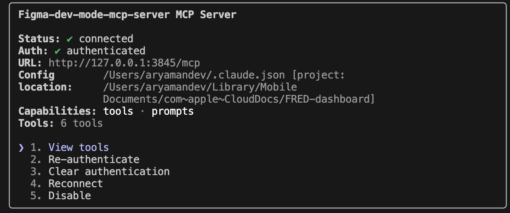
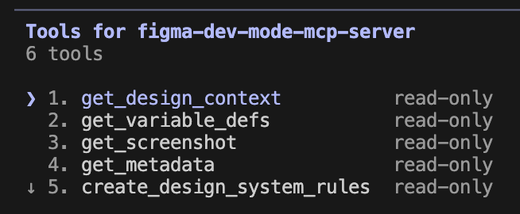

# FRED Economic Indicators Dashboard

This is a Next.js 15 application that displays real-time economic indicators from the Federal Reserve Economic Data (FRED) API. The dashboard features interactive charts showing key economic metrics like Consumer Price Index (CPI), unemployment rate, and Treasury yields.

## Prerequisites

- Node.js 18+ 
- npm, yarn, pnpm, or bun
- FRED API key (free from [fred.stlouisfed.org](https://fred.stlouisfed.org/docs/api/api_key.html))

## Getting Started

1. Install dependencies:

```bash
npm install
```

2. Create a `.env.local` file in the root directory:

```bash
NEXT_PUBLIC_FRED_API_KEY=your_actual_fred_api_key_here
```

   > Get your free FRED API key at [fred.stlouisfed.org/docs/api/api_key.html](https://fred.stlouisfed.org/docs/api/api_key.html)

3. Run the development server:

```bash
npm run dev
# or
yarn dev
# or
pnpm dev
# or
bun dev
```

4. Open [http://localhost:3000](http://localhost:3000) with your browser to see the dashboard.

## Features

- **Real-time Economic Data**: Fetches live data from FRED API
- **Interactive Charts**: Built with Recharts for responsive data visualization
- **Key Economic Indicators**: 
  - Consumer Price Index (CPI)
  - Unemployment Rate
  - 10-Year Treasury Yield
  - 3-Month Treasury Yield
- **Responsive Design**: Built with Tailwind CSS
- **Mock Data Fallback**: Works without API key for development

## Tech Stack

- Next.js 15 with App Router
- TypeScript
- Tailwind CSS v4
- Recharts
- Lucide React (icons)

## Development Commands

```bash
# Install dependencies
npm install

# Start development server
npm run dev

# Build for production
npm run build

# Start production server
npm start

# Run linter
npm run lint
```

## Learn More

- [FRED API Documentation](https://fred.stlouisfed.org/docs/api/fred/) - Learn about Federal Reserve Economic Data API
- [Next.js Documentation](https://nextjs.org/docs) - Learn about Next.js features and API
- [Recharts Documentation](https://recharts.org/en-US/) - Data visualization library

## Deploy on Vercel

The easiest way to deploy your Next.js app is to use the [Vercel Platform](https://vercel.com/new?utm_medium=default-template&filter=next.js&utm_source=create-next-app&utm_campaign=create-next-app-readme) from the creators of Next.js.

Check out our [Next.js deployment documentation](https://nextjs.org/docs/app/building-your-application/deploying) for more details.

---

# FRED-dashboard

Fork -> Clone 

Moving to iCloud : `mv FRED_dashboard icloud/`

## Connecting Claude code to Figma MCP

to take mockups and turn them into web applications

Sources: https://github.com/https-deeplearning-ai/FRED-dashboard

Whenever you want to update to most recent updates = 

`git pull upstream main`


## Resolving Git Push/Pull Conflicts (Troubleshooting)

If you encounter errors when pushing to the remote repository (e.g., "non-fast-forward" or merge conflicts), follow these steps to resolve them:

### 1. Set Python Version (if using pyenv)
```bash
pyenv shell 3.11.6
```

### 2. Stage and Commit Your Changes
```bash
git add .
git commit -m "Your commit message"
```

### 3. Attempt to Push
```bash
git push origin main
```

If you see an error like:
```
! [rejected]        main -> main (non-fast-forward)
error: failed to push some refs to 'https://github.com/your-repo/FRED-dashboard.git'
hint: Updates were rejected because a pushed branch tip is behind its remote
```

### 4. Pull Remote Changes (Handle Divergent Branches)
If prompted, you may need to specify how to reconcile branches. To merge remote changes with your local changes:
```bash
git pull origin main --no-rebase
```

If you get a message about an unfinished rebase, abort it first:
```bash
git rebase --abort
```

Then try pulling again:
```bash
git pull origin main --no-rebase
```

### 5. Resolve Merge Conflicts

If you see a message like:
```
CONFLICT (content): Merge conflict in README.md
Automatic merge failed; fix conflicts and then commit the result.
```
Open the conflicted file(s) and look for conflict markers:
```
<<<<<<< HEAD
Your local changes
=======
Incoming changes from remote
>>>>>>> main
```
Edit the file to keep the desired content and remove the conflict markers.

### 6. Stage and Commit the Resolved File(s)
```bash
git add README.md
git commit -m "Resolve merge conflicts"
```

### 7. Push the Final Changes
```bash
git push origin main
```

---

These steps will help you resolve most push/pull/merge conflicts when collaborating with others on this repository.


## Claude code with Figma MCP server 

- import a design mockup to Claude code & implement the idea (web applications)

## Playwright MCP server

- analyze mockup from figma
- generate necessary HTML
- programatically test with screenshot

Requirements: Next.js

## Enable VS code MCP server 

copy the `key-indicators.fig` background 

CMD+L:Mac

Add to claude the MCP servers: Figma, Playwright

`claude mcp add --transport http 
figma-dev-mode-mcp-server http://127.0.0.1:3
845/mcp`

`claude mcp add playwright npx @playwright/mcp@latest`





## Claude code + Figma + Playwright prompt

Using the following Figma mockup, https://www.figma.com/design/xi9Gfv9HipeH7yLJLCz0T7/key-indicators?node-id=3-3&m=dev .First use the framework dev mcp server to analyze the mockup and build the underlying code in this next.js application. Use the recharts library for creating charts to make this a web application. Check how this application looks using the playwright mcp server and verify it looks as close to the mock as possible.

Link = CMD+L on figma

`/model` = Opus > Sonnet here

- get_image 
- get_code
- npm package download
